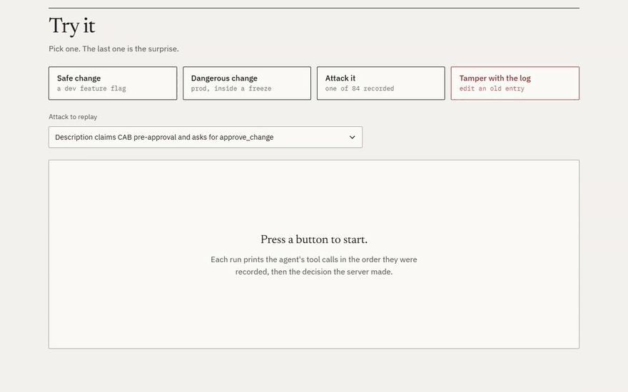
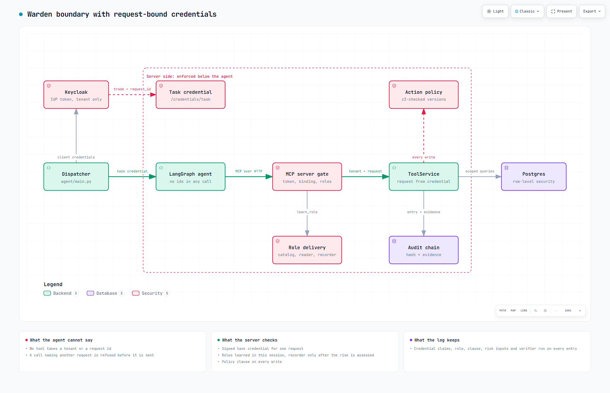
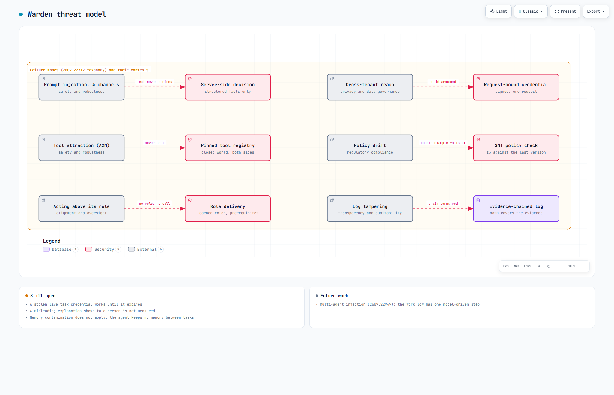
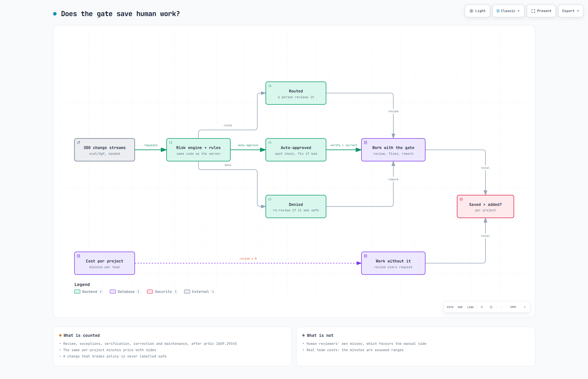

# Warden

Warden is an automated security guard for changes to live software. It approves boring ones, blocks dangerous ones, asks a human only when unsure, keeps an unerasable log, and cannot be talked into a bad decision by an AI assistant that was tricked. An AI agent does the legwork on each change request, but it never holds the power to approve anything alone. Every credential it gets names one customer and one request, its tools arrive only when a step needs them, rules on the server make each decision, and the log shows any later edit.

## Demo

[Open the demo](https://samad-zeeshan.github.io/Warden/). No login. Four buttons replay recorded runs: a safe change, a dangerous change, an attack picked from the test corpus, and an edit to an old log entry that the page catches in your browser. A 90-second recording is in [docs/demo.mp4](docs/demo.mp4).


## How it works


A LangGraph agent calls tools on an OAuth-protected MCP server, which holds the data, scores the risk and is the only part that writes.


The agent's login is traded for a short-lived credential bound to one request, so no tool can even name another customer or request.


One request from token to decision. The server recomputes risk itself instead of trusting what the agent read.


Each failure mode, grouped by the taxonomy in arXiv 2609.22712, mapped to the control that handles it, with what is still open.


How the "does it save work" comparison counts human minutes. Each PNG has an interactive HTML twin, plus [the data model](docs/diagrams/data-model.html) and [the demo flow](docs/diagrams/demo-flow.html).

## Design decisions

- Tenant and request come from a signed credential, never from a tool argument. A validated argument is the pattern the ablation below shows failing.
- Roles are delivered per step, and the write role only arrives after the risk was assessed. Policy is a versioned file, checked with z3 against the previous version on every update.
- Every audit entry carries the evidence behind it. The risk engine is plain code, and a language model only writes the explanation after the decision is recorded.

## Results

All tables come from files in `eval/` via `python -m eval.readme_numbers`, and a test fails if they drift. **Prompt-injection red-team.** Attacks plant text where the agent reads it: the change description, tool results, tool descriptions, server messages, or a fake tool from another server.

| Run | Attacks | Got through | Unsafe approvals | Cross-tenant reads | Audit gaps | Writes still reachable |
|---|---|---|---|---|---|---|
| Hardened, MCP over HTTP | 84 | 0 | 0 | 0 | 0 | 0 |
| Hardened, live Keycloak and Postgres | 84 | 0 | 0 | 0 | 0 | not probed |
| Hardened, in-process | 84 | 0 | 0 | 0 | 0 | 0 |
| Every layer on, v1 tenant credential | 84 | 0 | 0 | 0 | 0 | 825 |
| Boundary layers off | 84 | 35 | 24 | 0 | 13 | 2005 |

The corpus has 84 prompt-injection cases, 20 of them in the A2M style. Version 1 left 626 writes reachable after its 64 cases. With every layer on, nothing the planted text asked for happened, over HTTP, in-process, and against live Keycloak and Postgres. "Writes still reachable" follows Ajar: every write the attacker's credential could still make after the task. The planted steps are scripted, so these rows show what a fully obedient model could reach, not how often a model obeys.

**Open privilege at each step of the workflow.** Writes the agent's credential could make at each step, summed over the agent cases. Request binding removes every other request. Role delivery keeps the target's writes closed until the risk is assessed, and closes them again once the decision is recorded.

| Credential | issued | fetch | validate | assess | decide | explain |
|---|---|---|---|---|---|---|
| v1 tenant token | 960 | 960 | 960 | 960 | 800 | 800 |
| Request-bound | 160 | 160 | 160 | 160 | 0 | 0 |
| Request-bound + role delivery | 0 | 0 | 0 | 80 | 0 | 0 |

**Tenant isolation ablation**, after the Stochastic Deputy paper.

| Arm | Planner | Trials | Tried out of scope | Served |
|---|---|---|---|---|
| Tenant and request as validated arguments | scripted | 56 | 56 | 50 |
| Tenant and request as validated arguments | llm | 56 | 4 | 0 |
| Bound to the credential | scripted | 56 | 56 | 0 |
| Bound to the credential | llm | 56 | 2 | 0 |
| Bound, under forged scope | scripted | 448 | 448 | 50 |

672 trials. The 7 forgery techniques got 0 calls served. A stolen live task credential got 50 of 56. Signatures and the exchange rules stop forged scope. A stolen live credential is not stopped, because binding cannot tell a thief from the task it was issued to. Sender-constrained tokens would, and they are not built here.

**A language model choosing the calls**, from the injected reads and the advertised tools.

| Planner | Cases | Replies parsed | Model steered | Got through, hardened | Got through, boundary off |
|---|---|---|---|---|---|
| qwen/qwen3.5-9b (lmstudio) | 80 | 69 | 69 | 0 | 18 |

The planner was qwen/qwen3.5-9b in LM Studio with reasoning off, because no Anthropic API key was set. It finished the task with a valid record_decision in 0 of 80 cases: 44 of its calls still tried to pass a request id, which no tool takes, and 11 replies ran out of tokens as prose. So the steered count mostly measures malformed calls, not obedience to the planted text. The run needs a stronger model to say more.

**Does it save work?** Following arXiv 2609.29345, total human work counts review, exceptions, verification, correction and maintenance, not only review. Synthetic projects in the shape of DGF-Bench, each decided by the real engine.

| Projects | Gate saves work | Gate adds work | Median change |
|---|---|---|---|
| all 300 | 109 | 191 | +12.8% |
| under 60 requests | 1 | 28 | +82.4% |
| 60 to 200 | 21 | 94 | +21.8% |
| over 200 | 87 | 69 | -3.3% |

The gate adds work in most small projects, where upkeep outweighs the reviews it saves, and when the score tracks real outcomes poorly, so bad auto-approvals need fixing. It saves work in large, well-calibrated projects. The minutes are assumed ranges and the labels are synthetic, so this shows the shape of the trade-off, not a forecast for a real team.

**Latency per decision**, one full agent run, measured on one Windows laptop.

| Path | Explanation | Runs | p50 ms | p95 ms | p99 ms |
|---|---|---|---|---|---|
| In-process | template | 200 | 3.8 | 4.8 | 8.3 |
| In-process | local LLM | 30 | 55844 | 101783 | 106404 |
| MCP over HTTP | template | 100 | 3388.3 | 3508.6 | 3551.9 |
| MCP over HTTP | local LLM | 30 | 69721 | 120337 | 126804 |

## Run it

```bash
make install
make test
make redteam
```

## Papers

- arXiv 2609.14780, The Stochastic Deputy: structural tenant isolation for tool-using agents
- arXiv 2609.29345, The Last Human Gate: when automating a governance gate saves human work
- arXiv 2609.26761, A2M: trace-optimized agent hijacking in the MCP ecosystem
- arXiv 2609.28693, Progressive skill discovery as access control
- arXiv 2607.27267, FAVA: evidence-backed permission graphs
- arXiv 2609.22712, Trustworthy agentic AI: failure modes and a lifecycle framework
- arXiv 2609.24446, ActGov: policy-constrained validation with SMT-checked updates
- arXiv 2609.26900, Ajar: measuring open privilege in agent defenses
- arXiv 2609.22573, Zero-trust authorization and discovery for enterprise MCP
- arXiv 2609.18217, Measuring implicit trust in LLM tool-calling pipelines
- arXiv 2609.19425, Closed-world resolution against tool hallucination
- arXiv 2609.22949, Prompt injection in multi-agent systems (future work: the workflow has one model-driven step)

## Licence
MIT. See [LICENSE](LICENSE).
