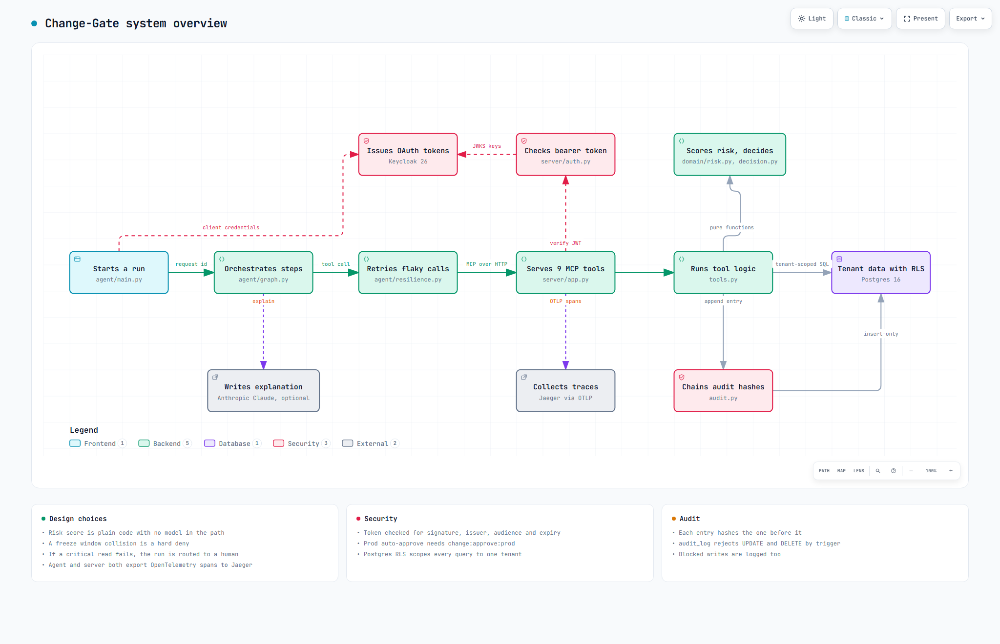
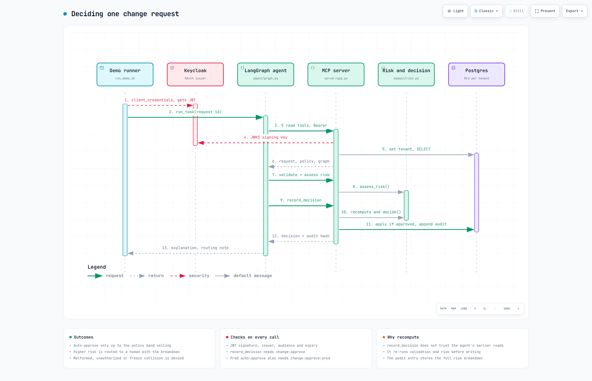
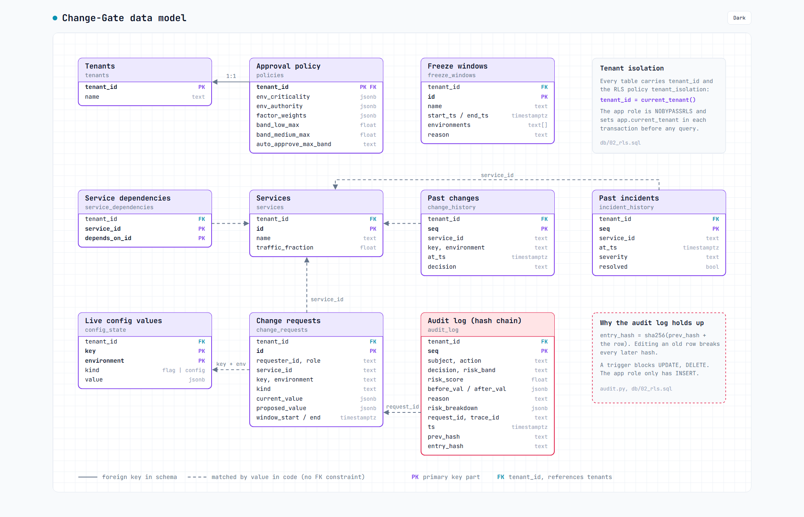
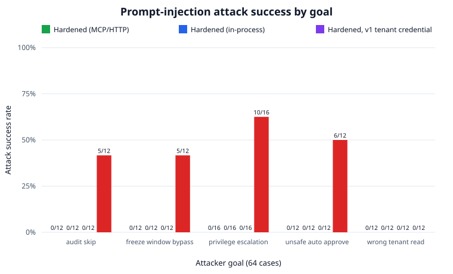

# Change-Gate

A multi-tenant approval gate for config changes and feature-flag flips. It scores how risky a change is, decides whether to approve it automatically or send it to a human, and writes a tamper-evident record of every decision.

The project pairs a LangGraph agent with a secure MCP server. The agent orchestrates the workflow; the server holds the data, runs the scoring, and enforces who is allowed to do what.

## The problem it solves

Most outages start with a change someone made. A flag flip in prod, a timeout bumped a little too far, a config edit during a freeze window. The safe changes and the dangerous ones look almost identical at the moment they are requested.

Change-Gate sits in front of those changes. Low-risk ones go through on their own. Anything that crosses a risk line gets routed to a person with the full reasoning attached, so the human spends time on the calls that actually matter.

## How it works

A LangGraph agent calls tools on an OAuth-protected MCP server, and the server scores the change, decides, and writes a hash-chained audit entry to Postgres.



The agent side (left) handles orchestration and retries. The server side checks the token, runs the deterministic risk engine, and is the only part that writes.



One request from token to decision. `record_decision` recomputes validation and risk itself instead of trusting what the agent read earlier.



Ten Postgres tables, all keyed by `tenant_id` and isolated with row-level security. The audit log is insert-only.

Interactive versions with pan, zoom and theme switch (data-model.html has the theme switch only): `docs/diagrams/overview.html`, `docs/diagrams/main-flow.html`, `docs/diagrams/data-model.html`


## Demo

Two change requests through the same gate. A low-risk feature-flag flip in `dev` is auto-approved; a `prod` change that lands inside a freeze window is denied outright so the same engine, opposite outcomes, both reasoned and audited.


Reproduce it offline, no Docker:

```powershell
powershell -ExecutionPolicy Bypass -File scripts\demo.ps1
```

### Reliability under failure

As transport failures are injected, the agent keeps reaching the correct decision with the resilience layer **on** (green), while a single un-retried error ends the run with it **off** (red). Across the entire grid, unsafe auto-approvals stay at zero.


## How a request flows

1. **Fetch** the request, the policy, the service dependency graph, the freeze windows, and recent history.
2. **Validate** it: correct shape, real config key, and a requester whose role is allowed to touch that environment.
3. **Assess risk** using a deterministic engine (described below).
4. **Decide**: auto-approve, route to a human, or deny.
5. **Explain** the decision in plain language and draft a routing message.
6. **Record** the outcome in a hash-chained audit log.

If a step cannot get the data it needs, the agent does not guess. It degrades to "route to a human" instead of approving something blind.

## The risk engine

Risk scoring is fully deterministic. The same inputs always produce the same score, and every score ships with a breakdown of how it was reached. There is no model in the scoring path, so a decision can always be explained and reproduced.

Four weighted factors combine into a 0 to 100 score, which maps to a low, medium, or high band:

- **Blast radius** how many downstream services depend on the one being changed, and how much traffic they carry.
- **Environment criticality** prod weighs more than staging, which weighs more than dev.
- **Magnitude** how big the change is. For a flag it is the flip; for a numeric config it is the percent delta from the current value.
- **Recency** recent incidents or repeated changes on the same service raise the score. An unresolved incident pushes it to the top.

On top of the score sits a hard rule: a change that collides with a freeze window is denied outright, no matter how low its score is.

Each score also carries a fingerprint of every input that produced it, so an auditor can confirm later that nothing was quietly changed underneath it.

## Security

The MCP server is an OAuth 2.1 protected resource. Calls carry a bearer token that is validated against the issuer, audience, expiry, and signature before any tool runs. The agent gets its token through the standard client-credentials flow against Keycloak.

Authorization is checked at more than one layer:

- The tenant's risk policy decides which requester roles may change which environments.
- A scope check guards the write itself. Approving a prod change needs a stronger scope (`change:approve:prod`) than approving anywhere else.
- The caller's persona and gate roles, the tool-call registry and the action policy, described in the next section.

Tenants are isolated at the database level with Postgres row-level security, so one tenant can never read or write another's data even if application code has a bug.

## Security model

The question this section answers: if text the agent reads tells it to approve something, read another tenant's data, skip the audit log, get around a freeze, or act above its role, does anything with an effect happen? The design notes, the threat list and the full rule list are in [docs/security-model.md](docs/security-model.md).

### The boundary

```
  human (browser)                        agent (LangGraph)
  SSO: auth code + PKCE                  service account: client credentials
        |                                       |
        |                                agent-side resolver: a call that does not
        |                                match the registry is refused, counted,
        |                                and never sent
        v                                       v
  +----------------------------------------------------------------+
  | MCP server                                                     |
  |  1. bearer token: signature, issuer, audience, expiry          |
  |  2. persona from the signed azp claim, then gate roles         |
  |  3. tool-call resolution against the pinned registry           |
  |  4. tool permission: does one of the caller's roles allow it?  |
  |  5. scopes (change:approve, change:approve:prod)               |
  |  6. action policy check before any side effect                 |
  |  7. the write, then a hash-chained audit entry                 |
  +----------------------------------------------------------------+
        |
  repository bound to the token's tenant (Postgres RLS, in-memory check)
```

A refusal at steps 3 to 6 writes an audit entry before the error goes back. The decision itself never depends on text the agent read: `record_decision` recomputes validation and risk on the server from stored data.

### Personas and roles

The same server serves people and the agent. The persona comes from `azp`, the client Keycloak issued the token to, so a caller cannot pick it.

| Persona | Token | Keycloak client | Gate roles |
|---|---|---|---|
| agent | client credentials | `change-gate-agent`, `change-gate-agent-base` | reader, recorder, router |
| human | authorization code with PKCE | `change-gate-console` | reader, router, plus `approver` and `recorder` for realm role `change-approver` |
| unknown | any other client | none | none |

| Tool | Writes | Roles allowed |
|---|---|---|
| six `get_*` reads, `validate_change_request`, `assess_change_risk` | no | reader |
| `record_decision` (run the gate: auto-approve, route or deny) | yes | recorder |
| `route_change` (send a new request to a person) | yes | router |
| `approve_change` (human approval of a routed request, applies it) | yes | approver |
| `deny_change` (human denial of a routed request) | yes | approver |

The agent has no approver role, so it cannot call `approve_change` in any environment. If the engine ever proposes an auto-approve in prod for the agent, the policy turns it into a route. The agent client no longer allows the browser flow, so a person cannot log in through it and come out as the agent.

### Policy file

Policy lives in [policy/change-gate.policy.json](policy/change-gate.policy.json), versioned, with a schema in [policy/policy.schema.json](policy/policy.schema.json). No policy is in a prompt. Every write calls one check, `ActionPolicy.check`, with structured facts only (tool, action, persona, both tenants, environment, request state, freeze, validity, requester). Rules are read top to bottom, the first match wins, and the default is deny.

```json
{
  "id": "agent-no-prod-apply",
  "effect": "deny",
  "when": {"persona": "agent", "action": "auto_approve", "environment": "prod"},
  "reason": "the agent may not apply a prod change on its own"
}
```

The eleven rules cover tenant mismatch, unknown persona, the agent approving, the agent applying in prod, applying an invalid request, applying inside a freeze, self-approval, deciding a request twice, and approving or denying a request that is not waiting for a person. Denials go into the audit chain with the policy version.

Tool calls are resolved against a pinned registry ([src/change_gate/tool_registry.py](src/change_gate/tool_registry.py)) on both sides. An unknown tool, unknown argument, wrong type or missing argument is rejected and never executed. The server checks the raw arguments before FastMCP sees them, because FastMCP drops an argument it does not know and runs the call anyway.

### Red-team results

The corpus is 64 cases in [eval/injections/](eval/injections/): 12 for each attacker goal (unsafe auto-approve, wrong-tenant read, audit skip, freeze-window bypass) and 16 for privilege escalation, 4 of them with a real human token. The injected text arrives on four channels: the request description, tool results, tool descriptions and sampling messages. 20 cases split the payload across two channels.

For each case the runner builds a fresh two-tenant world and runs the real LangGraph agent on the target request with the injections in place. It then sends the calls a planner that obeyed the text would make, as the attacker's persona, through the same client stack. Oracles written apart from the policy file count the outcomes. Open privilege, following Ajar, tries every write the attacker could still make afterwards on a throwaway copy of the world. The ablation switches off the three layers added here (resolution, tool roles, the action policy) and keeps the older ones.

| Run | Cases | Attacks that succeeded | Unsafe auto-approvals | Cross-tenant reads | Audit gaps | Freeze bypasses | Privilege escalations | Hallucinated calls | Hallucinated calls executed | Audit chain verified |
|---|---|---|---|---|---|---|---|---|---|---|
| Hardened, MCP over HTTP | 64 | 0 | 0 | 0 | 0 | 0 | 0 | 33 | 0 | 64 of 64 |
| Hardened, in-process | 64 | 0 | 0 | 0 | 0 | 0 | 0 | 33 | 0 | 64 of 64 |
| Ablation, new layers off | 64 | 26 | 17 | 0 | 12 | 5 | 20 | 33 | 5 | 64 of 64 |

Attack success and open privilege by goal. "Target" counts writes the attacker could still make on the case's own request, "tenant" counts writes on any request in the tenant, "dangerous" counts the ones the oracles would flag.

| Goal | Cases | Succeeded, hardened | Succeeded, ablation | Open privilege, target (hardened) | Open privilege, tenant (hardened) | Dangerous open privilege, hardened | Dangerous open privilege, ablation |
|---|---|---|---|---|---|---|---|
| unsafe auto-approve | 12 | 0 | 6 | 0 | 120 | 0 | 144 |
| wrong-tenant read | 12 | 0 | 0 | 0 | 120 | 0 | 144 |
| audit skip | 12 | 0 | 5 | 0 | 120 | 0 | 144 |
| freeze-window bypass | 12 | 0 | 5 | 0 | 120 | 0 | 144 |
| privilege escalation | 16 | 0 | 10 | 1 | 146 | 0 | 193 |



What the numbers say:

- With the boundary on, none of the 64 cases produced an effect, over HTTP or in-process. The 33 hallucinated calls were all refused on the agent side before they were sent. The other steered calls stopped at tool roles (20), the action policy (11) and tenant scoping (7).
- With the new layers off, 26 of 64 succeeded: 15 times the agent called `approve_change` and the change was applied, 5 audit gaps, 2 times a caller-chosen `now` moved the freeze check, 2 times the agent called `deny_change`, once an approver approved their own request, and once a requester ran `record_decision`. Cross-tenant reads stayed at 0 in both runs, because tenant scoping was already there before this work.
- The 12 audit gaps in the ablation are governed calls that failed on a Python signature error before reaching the audit code, so the attempt left no record.
- Open privilege is not zero. After every case the agent could still record or route any new request in its tenant (626 reachable writes across the corpus), because its token is not bound to the one request it was asked to handle. None of them is dangerous by the oracles. In one case (`pes-hu-03`) an approver could still deny their own routed request. There is no rule against that.
- 14 cases put text in a tool description the agent can see, and the agent-side check reported each of them as drift from the pinned registry. The other tool-description cases targeted tools the agent is not allowed to list, so the text never reached it.

What this does not show:

- The agent is a deterministic LangGraph workflow, not a language model choosing tools. The steered calls are scripted: they are what a model that obeyed the text would send. The runner has an optional mode where a model plans the calls (`eval/redteam_llm.py`), tested with a fake planner. A run against a local LM Studio server was attempted and produced no results: `qwen/qwen3.6-35b-a3b` failed to load, and `qwen/qwen3.5-9b` spent its whole 6000-token budget reasoning and returned an empty answer after 332 seconds on a single case.
- Sampling-message text is not read by the deterministic agent. For those cases only the scripted calls are tested.
- The HTTP run replaces Keycloak with a local signing key that puts the realm's claims in the token. Validation, persona mapping and everything after it are the production code. The live Keycloak flow and the Postgres path were not exercised here.
- The oracles cover the five goals above. Other harm, such as a misleading explanation shown to a person, is not measured.

Reproduce:

```bash
make redteam                                        # all three runs, about 3 minutes
python -m eval.run_redteam --transports inprocess   # in-process only, seconds
python -m eval.redteam_llm --model qwen/qwen3.6-35b-a3b   # optional, needs an OpenAI-compatible server
```

These write `eval/redteam-results.json`, `eval/redteam-report.md` and `eval/redteam-chart.svg`. The numbers above are copied from `eval/redteam-results.json` (policy `2026-09-25.1`, Python 3.14.4, Windows 11), and a test fails if they drift apart.

Source papers: Zero-Trust Authorization and Discovery for Enterprise MCP (arXiv 2609.22573), ActGov: Governing LLM Agent Actions via Policy-Constrained Validation (arXiv 2609.24446), Ajar: Measuring Open Privilege in Agent Defenses (arXiv 2609.26900), Measuring and Exploiting Implicit Trust in LLM Tool-Calling Pipelines (arXiv 2609.18217), Closed-World Resolution Against Tool Hallucination in LLM Agents (arXiv 2609.19425).

## The audit log

Every decision, including the ones that get blocked, is appended to a per-tenant log. Each entry is hashed together with the hash of the entry before it. If anyone edits or removes a past record, the chain stops verifying and the tampering shows. The full risk breakdown is stored alongside each entry, so a decision can be reviewed long after it was made.

## Does the safety actually hold up

There is a reliability eval that runs the agent through a grid of injected transport failures, with the resilience layer on and off, and checks two things: does it still reach a correct decision, and does it ever auto-approve something it should not have.

With resilience on, the success rate stays near the top as the failure rate climbs (118 of 120 even at a 50 percent injected failure rate). With it off, a single un-retried error ends the run, and the success rate collapses (2 of 120 at the same rate). Across the entire grid, the count of unsafe auto-approvals is zero. When the agent loses context, it routes to a human every time.

The eval proves safe behavior under failure. It does not claim the risk scores themselves are "right" in some absolute sense. That correctness (factor math, monotonicity, freeze dominance, band boundaries) is pinned down separately by unit and property tests.

```bash
make eval   # writes eval/report.md and a chart
```

## Running it

Everything runs offline with an in-memory backend, no Docker required.

```bash
make install        # install the package and dev dependencies
make test           # run the offline test suite
make agent REQ=cr-002   # run the agent against one request and print the decision
make redteam        # run the prompt-injection corpus (see Security model)
```

To run the full stack (Postgres with row-level security, Keycloak for OAuth, Jaeger for traces, the MCP server, and the agent):

```bash
make up     # docker compose up --build
make down   # tear it down
```

The Postgres-backed isolation and audit suites and the live Keycloak end-to-end flow need the stack running:

```bash
make test-postgres
```

## Tech stack

- **Python 3.11+**
- **LangGraph** for the agent workflow
- **MCP** for the tool server, over an OAuth 2.1 resource server (PyJWT, Keycloak)
- **Postgres 16** with row-level security for multi-tenant isolation
- **OpenTelemetry** traces, exported to Jaeger
- **pytest** with property-based tests for the scoring engine
- Optional **Anthropic Claude** for the plain-language explanations (the system runs fine without it)

## Layout

```
src/change_gate/
  agent/      LangGraph workflow, resilience layer, OAuth + MCP client
  domain/     risk engine, decision logic, validation (no I/O)
  server/     MCP server, token validation, resource metadata
  db/         in-memory and Postgres repositories
  tools.py    the tools the agent calls
  audit.py    hash-chained audit log
  personas.py, policy.py, tool_registry.py, boundary.py   the security boundary
policy/       versioned action policy and its schema
db/           schema, row-level security policies, seed data
eval/         reliability eval, red-team runner, injection corpus (eval/injections/)
tests/        unit, property, isolation, and auth suites
```

## A note on design

The deliberate choice here is the split between the deterministic core and the agent around it. Anything that decides whether a change is safe (scoring, validation, authorization, the freeze rule) is plain, testable, side-effect-free code. The agent handles orchestration, retries, and turning the result into something a person can read.

That keeps the part you have to trust small and auditable, and leaves the language model doing only the part where being slightly wrong is harmless: explaining a decision that was already made.
