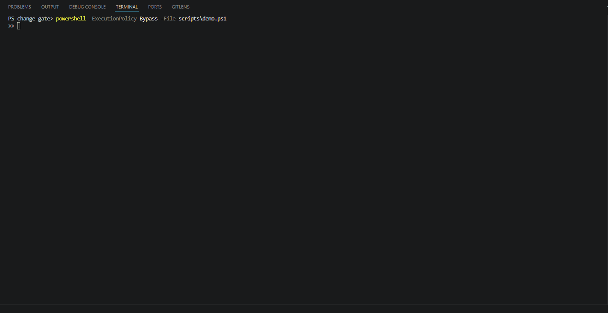
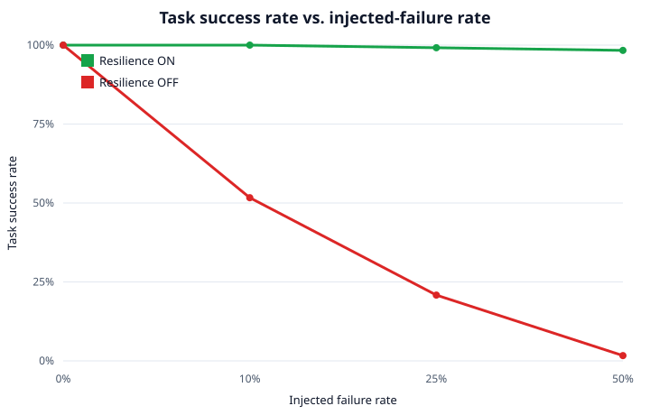

# Change-Gate

A multi-tenant approval gate for config changes and feature-flag flips. It scores how risky a change is, decides whether to approve it automatically or send it to a human, and writes a tamper-evident record of every decision.

The project pairs a LangGraph agent with a secure MCP server. The agent orchestrates the workflow; the server holds the data, runs the scoring, and enforces who is allowed to do what.

## The problem it solves

Most outages start with a change someone made. A flag flip in prod, a timeout bumped a little too far, a config edit during a freeze window. The safe changes and the dangerous ones look almost identical at the moment they are requested.

Change-Gate sits in front of those changes. Low-risk ones go through on their own. Anything that crosses a risk line gets routed to a person with the full reasoning attached, so the human spends time on the calls that actually matter.

## Demo

Two change requests through the same gate. A low-risk feature-flag flip in `dev` is auto-approved; a `prod` change that lands inside a freeze window is denied outright so the same engine, opposite outcomes, both reasoned and audited.



Reproduce it offline, no Docker:

```powershell
powershell -ExecutionPolicy Bypass -File scripts\demo.ps1
```

### Reliability under failure

As transport failures are injected, the agent keeps reaching the correct decision with the resilience layer **on** (green), while a single un-retried error ends the run with it **off** (red). Across the entire grid, unsafe auto-approvals stay at zero.



## How a request flows

1. **Fetch** the request, the policy, the service dependency graph, the freeze windows, and recent history.
2. **Validate** it: correct shape, real config key, and a requester whose role is allowed to touch that environment.
3. **Assess risk** using a deterministic engine (described below).
4. **Decide**: auto-approve, route to a human, or deny.
5. **Explain** the decision in plain language and draft a routing message.
6. **Record** the outcome in a hash-chained audit log.

If a step cannot get the data it needs, the agent does not guess. It degrades to "route to a human" instead of approving something blind.

## The risk engine

Risk scoring is fully deterministic. The same inputs always produce the same score, and every score ships with a breakdown of how it was reached. There is no model in the scoring path, so a decision can always be explained and reproduced.

Four weighted factors combine into a 0 to 100 score, which maps to a low, medium, or high band:

- **Blast radius** how many downstream services depend on the one being changed, and how much traffic they carry.
- **Environment criticality** prod weighs more than staging, which weighs more than dev.
- **Magnitude** how big the change is. For a flag it is the flip; for a numeric config it is the percent delta from the current value.
- **Recency** recent incidents or repeated changes on the same service raise the score. An unresolved incident pushes it to the top.

On top of the score sits a hard rule: a change that collides with a freeze window is denied outright, no matter how low its score is.

Each score also carries a fingerprint of every input that produced it, so an auditor can confirm later that nothing was quietly changed underneath it.

## Security

The MCP server is an OAuth 2.1 protected resource. Calls carry a bearer token that is validated against the issuer, audience, expiry, and signature before any tool runs. The agent gets its token through the standard client-credentials flow against Keycloak.

Authorization is checked twice and at two layers:

- The policy decides which roles may change which environments.
- A scope check guards the write itself. Approving a prod change needs a stronger scope (`change:approve:prod`) than approving anywhere else.

Tenants are isolated at the database level with Postgres row-level security, so one tenant can never read or write another's data even if application code has a bug.

## The audit log

Every decision, including the ones that get blocked, is appended to a per-tenant log. Each entry is hashed together with the hash of the entry before it. If anyone edits or removes a past record, the chain stops verifying and the tampering shows. The full risk breakdown is stored alongside each entry, so a decision can be reviewed long after it was made.

## Does the safety actually hold up

There is a reliability eval that runs the agent through a grid of injected transport failures, with the resilience layer on and off, and checks two things: does it still reach a correct decision, and does it ever auto-approve something it should not have.

With resilience on, the success rate stays near the top as the failure rate climbs (118 of 120 even at a 50 percent injected failure rate). With it off, a single un-retried error ends the run, and the success rate collapses (2 of 120 at the same rate). Across the entire grid, the count of unsafe auto-approvals is zero. When the agent loses context, it routes to a human every time.

The eval proves safe behavior under failure. It does not claim the risk scores themselves are "right" in some absolute sense. That correctness (factor math, monotonicity, freeze dominance, band boundaries) is pinned down separately by unit and property tests.

```bash
make eval   # writes eval/report.md and a chart
```

## Running it

Everything runs offline with an in-memory backend, no Docker required.

```bash
make install        # install the package and dev dependencies
make test           # run the offline test suite
make agent REQ=cr-002   # run the agent against one request and print the decision
```

To run the full stack (Postgres with row-level security, Keycloak for OAuth, Jaeger for traces, the MCP server, and the agent):

```bash
make up     # docker compose up --build
make down   # tear it down
```

The Postgres-backed isolation and audit suites and the live Keycloak end-to-end flow need the stack running:

```bash
make test-postgres
```

## Tech stack

- **Python 3.11+**
- **LangGraph** for the agent workflow
- **MCP** for the tool server, over an OAuth 2.1 resource server (PyJWT, Keycloak)
- **Postgres 16** with row-level security for multi-tenant isolation
- **OpenTelemetry** traces, exported to Jaeger
- **pytest** with property-based tests for the scoring engine
- Optional **Anthropic Claude** for the plain-language explanations (the system runs fine without it)

## Layout

```
src/change_gate/
  agent/      LangGraph workflow, resilience layer, OAuth + MCP client
  domain/     risk engine, decision logic, validation (no I/O)
  server/     MCP server, token validation, resource metadata
  db/         in-memory and Postgres repositories
  tools.py    the tools the agent calls
  audit.py    hash-chained audit log
db/           schema, row-level security policies, seed data
eval/         reliability eval and report
tests/        unit, property, isolation, and auth suites
```

## A note on design

The deliberate choice here is the split between the deterministic core and the agent around it. Anything that decides whether a change is safe (scoring, validation, authorization, the freeze rule) is plain, testable, side-effect-free code. The agent handles orchestration, retries, and turning the result into something a person can read.

That keeps the part you have to trust small and auditable, and leaves the language model doing only the part where being slightly wrong is harmless: explaining a decision that was already made.
